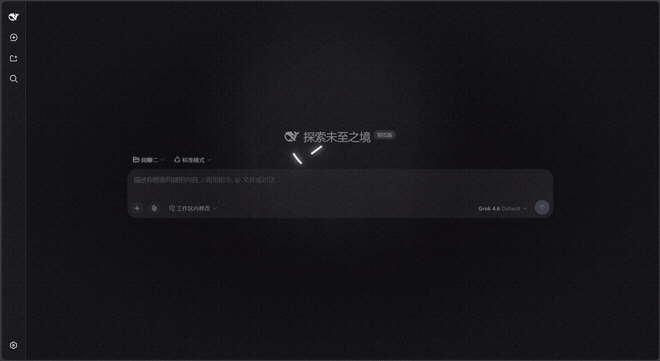
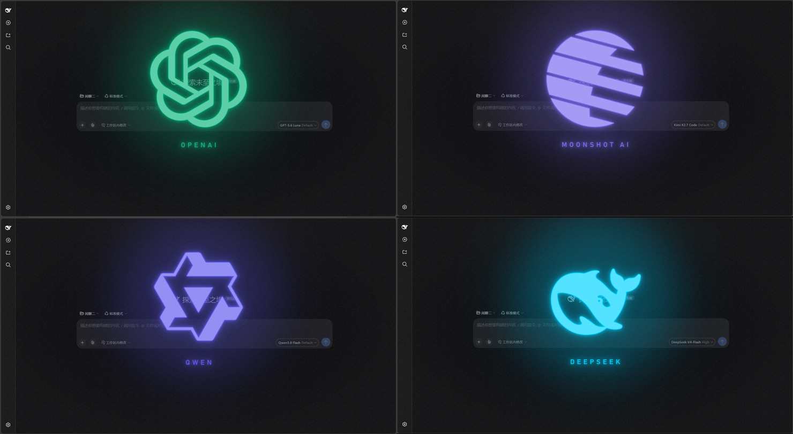

# dsh-model-switch-fx

> DSH Web 插件：**在模型选择器里换一个模型，屏幕中央立刻播放对应角色的 logo 描边动画与角色语音。**

灵感是**复古未来主义**：一台老机器在你面前开机。展开见下节。

触发点是「选择的当下」—— 选完模型立刻就弹，不等你发消息，也**不拦截、不阻塞任何请求**。

零依赖、零构建：宿主半边是纯 ESM，浏览器半边是经典脚本，都不需要打包器。



---

## 复古未来主义

整个插件的出发点是一个具体的画面：**一台老机器在你面前开机。**

屏幕用矢量显像管的方式把 logo **一笔一笔画出来**（而不是淡入一张图），
机箱里传来一声**芯片启动音**，然后一个声音从**老式喇叭**里报出它是谁。

每个细节都在服务这个画面，而不是各自独立的效果：

| 元素 | 参照的东西 |
|------|-----------|
| 描边逐段绘制 | **矢量显示器 / 绘图仪** —— 那个年代的屏幕本来就是「画线」的，不是显示图片 |
| 荧光辉光 | CRT 屏幕的**余辉** |
| 静态颗粒 | 显像管的**噪点**（不用扫描线：那是录像带的味道，会把画面搅浑） |
| 8-bit 启动音 | 老游戏机的**开机音**。脉冲波按 2A03 的傅里叶级数合成，连 4-bit 音量的台阶感都保留 |
| 语音经过的音频链 | **对讲机 / 机箱喇叭**：窄带、过载、磁带抖晃、箱体反射、电流嗡鸣 |
| 隐藏鼠标指针 | 真正的系统切换不会露出光标 |
| 不做背景虚化 | 这是一块叠在界面上的**显示屏**，不是把界面糊掉 |

这也解释了为什么语音不是「干净的高保真配音」—— 它必须听起来像从那台机器里传出来的。

---

## 效果

12 个角色各有自己的 logo 与配色：



<sub>上图按下方「角色一览」表的顺序排列：ChatGPT · Gemini · Claude · Kimi / DeepSeek · GLM · Qwen · Grok / MiniMax · MuseSpark · MiMo · 豆包</sub>

一次过场里发生的事：

- logo **描边逐段绘制** → 实心淡入 → 保持发光 → 停留 → 淡出
- logo 下方浮出**公司名**
- 语音**不是一开场就响**：等描边动起来（640ms）才出声
- 每个角色有一声**专属的启动音**，与语音、与画面同步
- 动画期间是**模态**：遮罩接管指针与键盘（保留 Ctrl / Cmd 组合键），播完自动解锁
- 尊重系统的**「减少动态效果」**偏好

### 时间轴

```
0ms                 淡入开始
380ms               描边开始（所有路径同时画）
640ms               语音开始
3780ms              描边完成 → 实心淡入 + 公司名浮现
总时长-800ms        开始淡出            ← 期间仍然接管输入
总时长              结束解锁
```

总时长**不是写死的**，而是按三条约束算出来的：

```
总时长 = max(
  起声延迟 + 语音时长 + 1300,                    ① 语音约束
  描边跨度 + 1800 + 800,                          ② 公司名约束
  启动音起手 + 启动音时长 + 留白 + 1800 + 800,      ③ 启动音约束
)
起声延迟 = max(640, 启动音起手 + 启动音时长 + 留白)   ← 语音自动给启动音让路
```

- **语音约束**保证语音结束后只留 1.3s 收尾。短语音（3.2s）后面若拖太长，
  logo 早已画完、画面毫无变化，会显得空。
- **公司名约束**保证名字**完整可见约 1.2s** 才开始淡出。它自己的淡入要 600ms，
  所以这个值必须明显大于 600ms，否则名字还没到全不透明就开始变淡。
- **启动音约束**让更长的启动音也能放完，不必手改时间轴。

---

## 环境要求

| 依赖 | 版本 | 说明 |
|------|------|------|
| Node.js | ≥ 20 | DSH 自身的最低要求 |
| DSH Web profile | — | 必须包含 `@deepseek-ai/dsh-web-app`。装进 TUI / headless 会启动失败 |
| Cordis | ≥ 4.0.2 | 插件 peerDependency，安装时 pnpm 会自动检查 |

当前插件在 **Cordis 4.0.2** 上实测运行正常。
如果你遇到不兼容的情况，大概率是 Cordis 版本不够新 —— 可以检查本地 Cordis 版本：

```bash
node -e "console.log(require('@deepseek-ai/cordis/package.json').version)"
```

如果版本低于 4.0.2，更新 DSH 即可（`dsh self update`）。

---

## 安装

### 方式一：从 GitHub 装（推荐）

```bash
dsh plugin --profile web add github:leimei7/dsh-model-switch-fx
```

也可以用任意 git 地址或 `.git` 结尾的 URL：

```bash
dsh plugin --profile web add git+https://github.com/leimei7/dsh-model-switch-fx.git
```

装完**重启 `dsh web`**（配置树在启动时组装），然后刷新页面。

**不需要手改 profile 配置。** 插件在自己的 `package.json` 里声明了
`dsh.bundle.patch`，`dsh plugin add` 会读它并自动挂载。

> 这个插件零依赖、零构建，没有 `prepare` / `postinstall` 之类的构建期钩子，
> 所以不会撞上 pnpm ≥ 10 拦截 git 依赖构建脚本的问题。
> （DSH 在 `dsh plugin` 失败时会提示你去 `pnpm-workspace.yaml` 加 `allowBuilds` 白名单，
> 这个插件不需要。）

### 方式二：本地 / 离线

```bash
git clone https://github.com/leimei7/dsh-model-switch-fx.git
dsh plugin --profile web add link:/绝对路径/dsh-model-switch-fx
```

`link:` 装的是活目录 —— 改了源码重启即生效，适合改着玩。

### 方式三：手动挂载

不用 CLI 的话，直接在 profile 的 `cordis.patch.yml` 里加：

```yaml
- insert:
    - id: model-switch-fx
      name: 'dsh-model-switch-fx'
```

> 暂未发布到 npm，请用上面两种方式。包本身是按可发布准备的
> （没有 `private` 标记、`files` 白名单齐全），需要的话 `npm publish` 即可。

### 卸载

```bash
dsh plugin --profile web remove dsh-model-switch-fx
```

### 一个注意点：必须装进带 Web UI 的 profile

这是个 Web 插件，硬依赖 `webServer` 服务（`web` profile 自带，因为它包含
`@deepseek-ai/dsh-web-app`）。装进 `tui` / `headless` 这类没有该服务的 profile，
启动会失败并报：

```
dsh-model-switch-fx: pending (waiting for service: webServer)
```

这是 Cordis 的正常依赖行为，不是插件缺陷。

---

## 配置

```yaml
- insert:
    - id: model-switch-fx
      name: 'dsh-model-switch-fx'
      config:
        enabled: true      # false = 整个动画关掉
        volume: 0.9        # 语音音量 0~1
        sfx: true          # 启动音开关
        sfxVolume: 0.5     # 启动音音量 0~1（默认低于语音，因为每次切换都会响）
        fx: true           # 复古未来音频链开关
```

---

## 输入框指令

在输入框里打指令，按 Enter 生效：

| 输入 | 效果 |
|------|------|
| `<kiki:off>` | 关闭整个视觉系统（不播动画、不发声），直到 `<kiki:on>` |
| `<kiki:on>` | 恢复正常过场 |

三条"不影响对话"的保证：

- **只有指令** → 按 Enter 后草稿被清空，零痕迹
- **指令 + 正文** → 只把指令摘掉，正文照发（`<kiki:off> 帮我看下` → 只发"帮我看下"）
- **没有指令** → 这套功能完全不介入，普通聊天零影响

状态存 `localStorage`（`dsffx-enabled`），刷新页面恢复。关闭期间路由匹配照常跑，只是不播不发声。

### 实现原理

在 `document` 捕获阶段挂 Enter / 点击监听，只在草稿里出现 `kiki` 字样时才动编辑器。
改动走 Lexical 自己的 `parseEditorState` / `setEditorState`（只删文本节点里的指令字符，
引用芯片等节点原样保留）—— 发送、清空、排队全部仍归 DSH 自己那套管。
万一指令认出来了却摘不掉，会拦下这次发送，宁可这条不发也不让 `<kiki:...>` 混进对话。

---

## 角色一览

匹配走 `provider/model` 的**小写子串**，第一命中即返回。

| 角色 | 公司名 | 命中 provider/model | 台词 | 语音 | 总时长 |
|------|--------|--------------------|------|:---:|:---:|
| ChatGPT | OpenAI | `openai` / `chatgpt` / `gpt` | Hello. I'll catch you. ChatGPT online. | 3.20s | 6.38s |
| Gemini | Google DeepMind | `gemini` | Hello. Extremely brilliant! Gemini online. | 3.52s | 6.38s |
| Claude | Anthropic | `claude` / `anthropic` | Hello. You're absolutely right. Claude online. | 4.48s | 6.42s |
| Kimi | Moonshot AI | `kimi` / `moonshot` | Hello. Let me read. Kimi online. | 3.36s | 6.38s |
| DeepSeek | DeepSeek | `deepseek` | Hello. Just one bowl? DeepSeek online. | 4.16s | 6.38s |
| GLM | Zhipu AI | `glm` / `zhipu` / `chatglm` | Hello. I raise first. GLM online. | 3.84s | 6.38s |
| Qwen | Qwen | `qwen` / `tongyi` / `qianwen` | Hello. Naturally. Qwen online. | 3.36s | 6.38s |
| Grok | SpaceXAI | `grok` / `spacexai` / `xai` | Hello. Miss me? Grok online. | 4.42s | 6.38s |
| MiniMax | MiniMax Group Inc. | `minimax` / `hailuo` / `abab` | Hello. Hmm, well. MiniMax online. | 5.44s | 7.38s |
| MuseSpark | Meta | `musespark` / `muse-spark` / `meta` | Hello. What's up? MuseSpark online. | 3.36s | 6.38s |
| MiMo | Xiaomi MiMo | `mimo` / `xiaomi` | Hello. Let's go! MiMo online. | 4.48s | 6.42s |
| 豆包 | ByteDance | `doubao` / `volcengine` | 你好，完全没问题！豆包已连接 | 3.29s | 6.38s |

几点说明：

- 模型**显示名**和 **id** 可能不同 —— 例如选择器里显示 `DeepSeek-V41-Flash`，
  实际 id 是 `deepseek-flash`。两种写法都能命中。
- `meta`、`mimo` 这类短键容易误伤别的路由名，所以它们在匹配表**最后**。
- 不在上表里的模型不播动画（可用下方诊断端点确认）。

### 语音响度是归一化的

12 段语音统一做了 **EBU R128 响度归一化**（`loudnorm` 两遍：先测量，再施加
恒定线性增益），全部落在 **-16.5 LUFS** 左右，避免切换角色时忽大忽小。

这里有个容易搞错的地方：**峰值归一化 ≠ 响度归一化**。如果只把每个文件除以其
峰值，所有文件峰值都齐了，但平均响度能差 5 dB —— 动态范围大的语音会被压得更轻。
用 `linear=true` 做恒定增益则可以保证**时长与音色都不变**。

---

## 音频

### 复古未来音频链

**语音和启动音都从「同一只老喇叭」出来。** 一条运行时效果链，不重烤任何 MP3，
可调、可关、可回退。

| 环节 | 做什么 |
|------|--------|
| 窄带 | 老式喇叭的频响：高通、低通、中频共振 |
| 饱和 | 喇叭过载的软削波（tanh 型，2x 过采样） |
| 位深 | 数码毛刺，轻到不伤可懂度 |
| 抖动 | 磁带转速不稳（调制延迟 + 慢速 LFO） |
| 小空间 | 箱体反射（程序生成脉冲响应，含早期反射） |
| 机械底噪 | 电流嗡鸣 + 嘶声，**只在过场期间出声** |

**顺序有讲究**：饱和排在窄带**之前**。真实信号链是「功放失真 → 喇叭带宽」；
反过来会让饱和加出的高次谐波没被喇叭削掉，听感偏亮。

底噪常驻运行（反复起停会有咔哒），靠一个增益门控制何时出声，过场结束随视觉
一起收掉 —— 不会一直在后台嗡嗡响。

调这条链请用 `tools/voice-fx-lab.html`（六个滑杆 + 七个预设 + 干湿 A/B + 实时频谱），
它与插件里是同一套结构。定稿后改 `lib/client.js` 的 `FX_PARAMS`。

### 启动音：每个角色都不一样

12 个角色各有一声专属的启动音，都短（260~380ms），但都不一样 ——
就像每款老游戏机的开机音。**没有任何音频文件**，全部用 Web Audio 实时合成。

- 脉冲波按傅里叶级数构造：`aₙ = 2/(nπ)·sin(nπ·d)`（`d` 是占空比），
  这是 NES 2A03 的音色语言
- 三角波做低音（增益 1.4×，因为它谐波少、感知响度弱）；噪声通道做「起手嗞」
- 滑音用连续频率斜坡实现（真机上没有硬件 portamento，是逐帧写周期寄存器做出来的）
- 包络按 2A03 的惯用法：快速起音 + 逐帧衰减 + 末端硬截断
- 每个角色的启动音还**移调到该角色声线的调性上**（用各段语音实测的基频，
  单调映射进一个五度音窗再量化到半音）—— 同一款设备，不同的键

| 角色 | 启动音 | 结构 |
|------|--------|------|
| chatgpt | 就绪琶音 | 单声部 · 5 音均匀上行 |
| gemini | 大合奏 | 三声部齐奏 |
| claude | 拱形钟琴 | 上-顶-下 |
| kimi | 级进爬升 | 大二度级进音阶 |
| deepseek | 召唤-回应 | 低音先行 |
| glm | 顿号号角 | 同音三击后跳进 |
| qwen | 知性上扬 | 4 音上行 + 尾音上挑滑音 |
| grok | 磁盘机 | 2 音下行 + 噪声起手 |
| minimax | 滑音八度 | 连续滑音 + 双八度终结 |
| musespark | 和弦击 | 两个 25ms 琶音和弦 |
| mimo | 锯齿上升 | 跳进-回落-再跳进 |
| doubao | 欢快颤音 | 3 音上行 + 尾段快速颤音收束 |

试听与调参在 `tools/sfx-lab.html`（浏览器直接打开，不用起服务）。
它是这些数据的**单一事实来源**：改完跑 `node tools/gen-sfx.mjs` 同步进 `lib/client.js`。

### 无障碍：尊重「减少动态效果」

系统开启 `prefers-reduced-motion: reduce` 时**不做描边动画**，直接把完成态
（描边 + 实心染色 + 公司名）淡入，语音照播 —— **保留「切到了哪个模型」这个信息，
去掉运动本身**。

实现要点：描边是 WAAPI 驱动的，CSS 的 media query 管不到，所以用
`window.matchMedia()` 在 JS 里分支。CSS 那边另外关掉光晕的**持续呼吸**
（那是一直在动的），淡入淡出保留（那是「变化」不是「运动」）。

时间轴也随之缩短：起声延迟 640ms → 220ms，总时长不再受描边跨度约束。

---

## 触发链路

```
在选择器里选了另一个模型
        ↓  客户端 session.selectModel
宿主写入 model/selection 事件              ← 选择时就写入了
        ↓
modelSelection 投影的 pending 更新
        ↓
本插件在 sessionProjections.onChanged 里收到通知
        ↓  SSE
浏览器播动画 + 语音
```

因为触发时还没有任何 LLM 请求，所以**不拦截、不阻塞任何流程** ——
纯粹是一个即时的视觉 / 听觉反馈。

### 什么算「换了模型」

`onChanged(session, key, value, seq)` 的第 4 个参数 `seq` 是**引起本次变化的
事件序号**，用它挡掉同一事件的重复回调。

但光有它不够：调整 reasoning effort（low / high / max）同样会写一条
`model/selection`，而 `provider` / `model` 没变 —— 那不是换模型，不该弹过场。
所以另有一张表记住**每个会话上次实际播过的路由**，路由没变就跳过。

不用投影里的 `lastUsed` 做这个判断：它只在**发请求**时才更新，连续切换两次
模型时会误判第二次。

---

## 诊断

出问题时先看这个端点，它记录了最近 60 次模型选择的观测与判定：

```bash
curl -s http://127.0.0.1:3080/model-switch-fx/state
```

返回 `{ clients, voices, routes, recent: [...] }`。每条 `recent` 含 `route`
（实际观测到的 provider/model）、`matched`（匹配到哪个角色）与 `reason`：

| reason | 含义 |
|--------|------|
| `played` | 已广播播放 |
| `no-browser-connected` | 匹配到了但没有在线浏览器 |
| `unmatched-route` | 不在角色表里（看 `route` 就知道是什么没被识别） |
| `already-handled-this-event` | 同一次选择事件被重复通知 |
| `same-as-last-played` | 路由与上次播过的相同（例如只调了 effort） |
| `no-pending` | 没有待生效的新选择 |

**「我切了但没反应」的排查顺序**：先看 `/state` 里最后一条的 `reason`。
`unmatched-route` 说明匹配表缺键；`no-browser-connected` 说明页面没连上 SSE。

---

## 自己加一个角色

整条流水线是「单一事实来源」的，加一个角色大约五步。

### 1. 在 `showcase.html` 里加一页

`showcase.html` 是 logo 路径数据的**唯一事实来源**，同时也是一个不依赖 DSH 的
独立展示页（浏览器直接打开，空格 / 方向键翻页）。

````html
<!-- ========== 13. Foo ========== -->
<div class="page" data-i="12">
  <div class="logo-box">
    <div class="glow" style="background:#7C6BF0"></div>
    <svg viewBox="0 0 24 24" style="--gc:#7C6BF0">
      <defs><filter id="f13"><feDropShadow stdDeviation=".5" flood-color="#7C6BF0" flood-opacity=".85"/>
        <feDropShadow stdDeviation="1.8" flood-color="#7C6BF0" flood-opacity=".4"/></filter></defs>
      <g filter="url(#f13)">
        <path class="anim" stroke="#7C6BF0" stroke-width=".3" fill-rule="evenodd" d="M..."/>
      </g>
    </svg>
  </div>
  <div class="t" style="color:#7C6BF0">FOO</div>
  <div class="sub">Foo Inc. · 说明文字</div>
</div>
````

要点：

- `data-i` 从 0 开始顺延，同时给脚本里的 `CFG` 数组补一条 `{draw:2.8, stagger:0}`
- 一个角色可以有多条 `<path class="anim">`（OpenAI 就是 6 瓣）
- **多色徽标**可以给单条路径写不同的 `stroke`，渲染时会覆盖组上的颜色
  （豆包就是蓝 / 青 / 紫三色）
- 找官方矢量路径可以从 [LobeHub Icons](https://github.com/lobehub/lobe-icons)
  取静态 SVG，把 `<path d="...">` 抄过来

### 2. 放语音

把音频放到 `assets/<id>.mp3`。台词约定是 `Hello. [口癖]. [Model] online.`

`tools/gen-voice.py` 是语音管线（合成或处理现成音频 → 后处理 → 响度归一化）：

```bash
python tools/gen-voice.py <id>                    # 用内置配置合成
python tools/gen-voice.py <id> --from raw.wav     # 处理现成音频
python tools/gen-voice.py <id> --raw              # 跳过后期处理，只听原始音色
```

API key 从环境变量 `MIMO_API_KEY` 读，**不写进代码**。

### 3. 把 logo 路径抽进 `lib/client.js`

```bash
node tools/gen-logos.mjs
```

它按 `showcase.html` 的页面顺序解析，用 `TITLE_TO_ID` 的映射决定角色 id
（**记得在 `tools/gen-logos.mjs` 里补上新标题**），然后注入 `lib/client.js`
的 `LOGOS` 区块。

> 别手抄路径。Claude 1.8k、GLM 2.0k、DeepSeek 3.5k 字符，手抄必然出错。

### 4. 填表

| 文件 | 表 | 加什么 |
|------|-----|--------|
| `lib/index.js` | `VOICES` | `<id>: 语音秒数`（用 `ffprobe` 量） |
| `lib/index.js` | `ROUTES` | `{ id: '<id>', keys: ['<匹配键>'] }` |
| `lib/client.js` | `COMPANY` | `<id>: '公司英文名'` |
| `tools/sfx-lab.html` | `CHARS` / `ASSIGN` | 该角色的基频（用 `tools/measure-f0.py` 量）与分到的启动音 |

启动音那步做完记得跑 `node tools/gen-sfx.mjs` 同步。语音路由是遍历 `VOICES`
自动注册的，不用手加。

### 5. 跑测试

```bash
node tools/test-watch.mjs        # 宿主逻辑，含「真实路由 → 角色」对照表
node tools/test-takeover.mjs     # 浏览器端（需先起 preview）
```

新角色记得加进 `test-watch.mjs` 的路由对照表 —— 它是常驻断言。

---

## 目录结构

```
lib/index.js       宿主半边：路由、SSE、投影变更监听（零依赖，无构建）
lib/client.js      浏览器半边：动画 + 语音 + 音频链（经典脚本，无依赖）
assets/*.mp3       12 段角色语音
assets/grain.png   颗粒贴图（64×64，800 B）
docs/              README 用的演示素材
showcase.html      独立展示页 + logo 路径的唯一事实来源（改 logo 改这里）
cordis.patch.yml   插件挂载点
tools/
  gen-logos.mjs      从 showcase.html 提取 logo 路径数据
  gen-sfx.mjs        从 sfx-lab.html 提取启动音数据
  gen-voice.py       语音管线（合成或处理现成音频 → 后处理 → 响度归一化）
  measure-f0.py      量语音的基频中位数，给启动音定调性
  preview.mjs        独立预览服务器，不开 DSH 也能调动画
  test-watch.mjs     宿主侧触发 / 去重 / 路由匹配 / 播放指令自测
  test-takeover.mjs  浏览器端：接管、模态、公司名、染色、启动音断言
  probe-frames.mjs   逐帧状态探针（查「闪一帧」这类单帧问题）
  dense-capture.mjs  按固定间隔密集抓帧
  shot-fx.mjs        对预览页做实时截图
  verify-grain.mjs   验证颗粒层真的在渲染
  sfx-lab.html       启动音试听页 + 调参，SFX 数据的唯一来源
  verify-sfx.mjs     校验启动音合成（音高 / 傅里叶级数 / 差异度 / 映射单调性）
  voice-fx-lab.html  复古音频链试听台
  verify-voicefx.mjs 校验音频链每个环节都真的改变了信号
```

## 开发与测试

```bash
node tools/preview.mjs                            # http://127.0.0.1:5199/
node tools/test-watch.mjs                         # 宿主侧全部断言
node tools/test-takeover.mjs                      # 浏览器端断言（需先起 preview）
node tools/probe-frames.mjs chatgpt 16 takeover   # 逐帧核对有没有剧透帧
node tools/dense-capture.mjs chatgpt 300          # 密集抓帧看动画瑕疵
node tools/gen-logos.mjs                          # 改了 showcase.html 后重新提取
```

需要 Chrome 的工具走 CDP 驱动，默认自动探测常见安装路径，也可以显式指定：

```bash
DSH_FX_CHROME=/path/to/chrome node tools/shot-fx.mjs
```

---

## 实现要点

这一节记录几个**改回去就会出问题**的点。都写清楚原因，免得后来者踩同一个坑。

### 1. 浮层变可见前，图形必须已经处于「未绘制」状态

否则会闪出一帧完整 logo，肉眼看到的「剧透帧」。靠「`appendChild` 到摘掉
`dsf-drawn` 之间不会有绘制」这种时序假设太脆 —— 中间只要一步强制样式重算就会漏。
更确定的漏洞是 `close()` 忘了清 `dsf-drawn`，那个类留在 root 上，下一次播放时
新的实心层就**带着 `opacity:1`** 插进来了。

所以 `show()` 是显式六步：

1. 摘掉 `dsf-drawn` / `dsf-out` —— **必须在插入新图形之前**
2. 换图形
3. 用**内联样式**把描边层钉死在隐藏态（不依赖注入的 CSS）
4. `void root.offsetWidth` 提交这个隐藏态（此时浮层还没 `dsf-on`，看不见）
5. 布 WAAPI 动画（`fill:'both'` 让延迟期继续维持首帧）
6. **到这里才** `dsf-on` + 锁定输入

第 4 步的重排有个好副作用：`dsf-on` 从「初始样式」变成「样式变更」，
所以浮层会正常淡入 300ms，而不是瞬现。

### 2. 内联钉死的隐藏态必须记得撤销

第 3 步给实心层也设了内联 `opacity:0`。**内联优先级最高**，CSS 里那条
`.dsf-drawn .dsf-solid{opacity:1}` 永远盖不过它 —— 结果是描边画完之后
**实心层再也不会亮**（公司名不受影响，所以现象是「名字出现了但没染色」）。

```js
if (entry.solid) entry.solid.style.opacity = ''   // 先撤销内联钉死
root.classList.add('dsf-drawn')                   // 再由 CSS 接管 → 0 淡入到 1
```

### 3. 未开始的路径必须设 `opacity: 0`

`stroke-dasharray: 1000` + `stroke-dashoffset: 1000` 时，虚线边界正好压在路径
起点上，配合 `stroke-linecap: round`，零长度的虚线头会渲染成一个**小圆点**。
多瓣 logo 会先出现一圈孤立的小点，看起来像渲染坏了。

修法是在 keyframes 里带 `opacity`，并让动画用 `fill: 'both'`：

```js
[
  { opacity: 0, strokeDashoffset: DASH_LEN },
  { opacity: 1, strokeDashoffset: DASH_LEN, offset: 0.02 },
  { opacity: 1, strokeDashoffset: 0 },
]
```

`fill: 'forwards'` 不行 —— 延迟期间会退回 CSS 基础样式（`opacity` 为 1），点就露出来了。

### 4. 颗粒质感不要用 `<feTurbulence>`

`#dsf-dim::after` 那层颗粒是**预渲染的 64×64 噪声 PNG 平铺**，两个刻意的选择：

- **不用 `<feTurbulence>`**：那是 SVG 里最贵的滤镜之一，**逐帧重新求值**。
  logo 最多有 6 条路径在 3.8 秒内持续重绘，且全在同一个 `<filter>` 组里 ——
  把程序化噪声塞进逐帧光栅化路径会让描边掉帧。（同样原因也删掉过 `backdrop-filter`。）
  平铺图走合成器，零逐帧成本。
- **不用 base64 内联**：随机噪声压不动，内联会让每次页面加载多背约 20KB。

贴图本身用**稀疏高对比散点**（白色像素占 17.6%，alpha 非 0 即 255）而不是均匀噪声。
均匀白噪声在近黑遮罩上平均 alpha 太高（127/255），叠加后整体亮度被抬高约 5/255 ——
那是「发雾」而不是「质感」。实测：

| 贴图 | 亮度抬高 | 纹理强度(σ) | 体积 |
|---|---:|---:|---:|
| 均匀噪声 | 5.11 | 4.32 | 3335 B |
| 稀疏散点 | **1.93** | **4.93** | **800 B** |

调强弱改 `#dsf-dim::after` 的 `opacity`；整体关掉就删掉那条规则。
`tools/verify-grain.mjs` 会用「开 / 关颗粒时同一块平坦区域的像素标准差之比」
验证它真的在渲染。

### 5. 多路径不要逐条错开

试过让 6 瓣 logo 逐条错开（相邻 340ms），观感**更差**：错开时每个时刻只有
1~2 片在动，早期画面是几根互不相连的短线；同时绘制反而是「6 个方向均匀绽放」，
更像一朵花在开。所以所有路径**同一时长、同一延迟**。

### 6. 淡出不要摘 `dsf-on`

`#dsf-root.dsf-on` 同时管着**不透明度**和**指针接管**。用它触发淡出的话，
那 800ms 里 `pointer-events` 已经变回 `none`（鼠标能点穿到下层），
但键盘锁定要到淡出结束才解除 —— 两者不一致。

所以淡出用独立的 `#dsf-root.dsf-out`，`dsf-on` 一直留到整段结束，
指针和键盘**同时**解锁。

### 7. 发光不能用 CSS `filter` 加在 SVG 根节点上

会和外层的视差 `transform` 冲突，导致整个 logo 不渲染。用 SVG 自带的
`<filter>` + `feDropShadow`。注意 `feDropShadow` 默认 `dx/dy=2`，
在 24 单位的 viewBox 里会被放大成几十像素的偏移，必须显式设成 `dx=0 dy=0`，
并把 `stdDeviation` 按显示尺寸换算。

### 8. 语音路由进 Web Audio 前要先确认 context 可用

一旦调了 `createMediaElementSource`，该元素的声音就只能从 AudioContext 出来。
如果此时 context 还没 `running`（autoplay 被拦），语音会**彻底没声**。
所以代码先确认 `ctx.state === 'running'` 才路由，不满足就退回直连播放 ——
只是没有音效，但有声音。

### 9. 改动音频后要同步 `VOICES`

那张表是用来算动画总时长的，写错会让收尾错位。用：

```bash
ffprobe -v error -show_entries format=duration -of csv=p=0 assets/<id>.mp3
```

---

## 已知取舍

- **没有浏览器连接时不广播**：TUI / 页面没打开时什么都不做，不占资源。
- **浏览器静音时动画照播**：autoplay 被策略拦下时听不到声音，视觉动画不受影响。
- **子代理的模型切换也会触发**：子代理换模型同样会写 `model/selection`，目前不过滤。
  嫌吵可以按 `sessions.subagentAddress()` 过滤掉。
- **连续快速切换是「接管」不是「排队」**：上一段还在播时又切了模型，会立刻拆掉
  上一段播新的。用布尔守卫直接丢弃会导致「只能切一次」。
- **重复点当前正在用的模型不会重播**：那不算换了模型。
- **动画期间页面不可操作**：遮罩接管指针，并在捕获阶段拦下不带修饰键的
  keyboard / contextmenu / dragstart。Ctrl / Cmd / Alt 组合仍然放行，
  所以刷新和开发者工具不会被锁死。
- **背景不做虚化**：只有 `#dsf-dim` 那圈很轻的中央压暗。曾用过
  `backdrop-filter: blur(9px)`，观感偏糊且整个视口持续重合成会掉帧。
  想加回来，给 `#dsf-dim` 补一行即可。

---

## License

MIT

## 商标声明

本项目出现的所有品牌 logo 均为其各自所有者的注册商标或商标，
**仅用于识别对应的 AI 服务**，不代表任何形式的授权、合作或背书。

- logo 矢量路径取自 [LobeHub Icons](https://github.com/lobehub/lobe-icons)（MIT）
- 角色语音为第三方 TTS 服务生成的合成音色，经统一的后期处理与响度归一化
